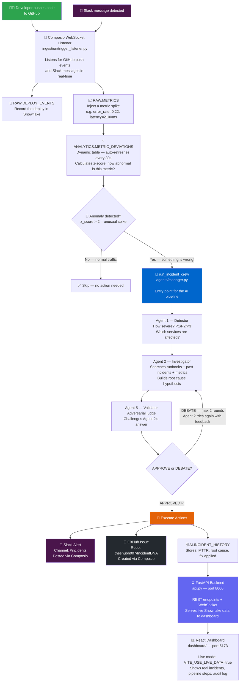
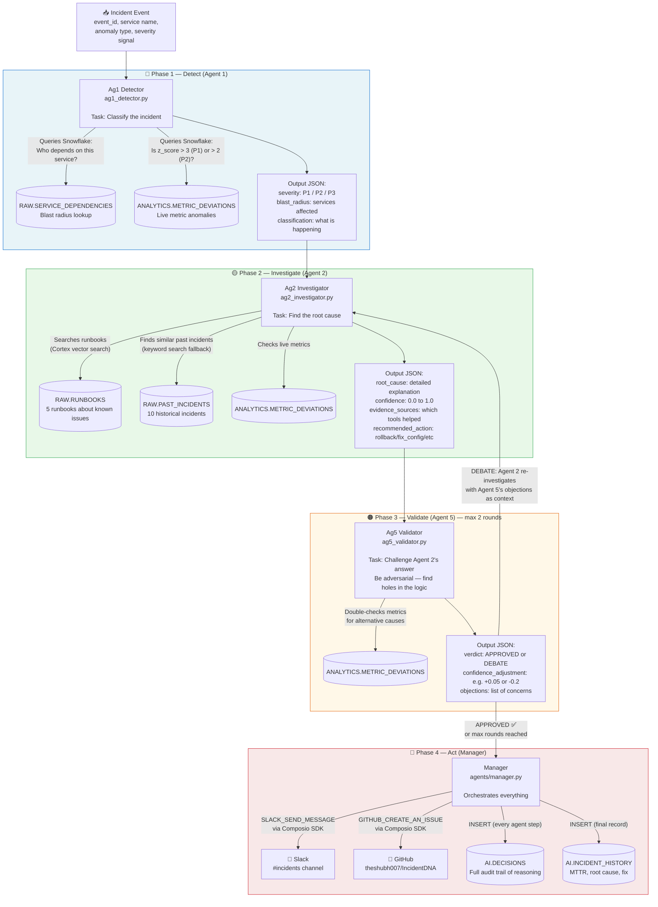
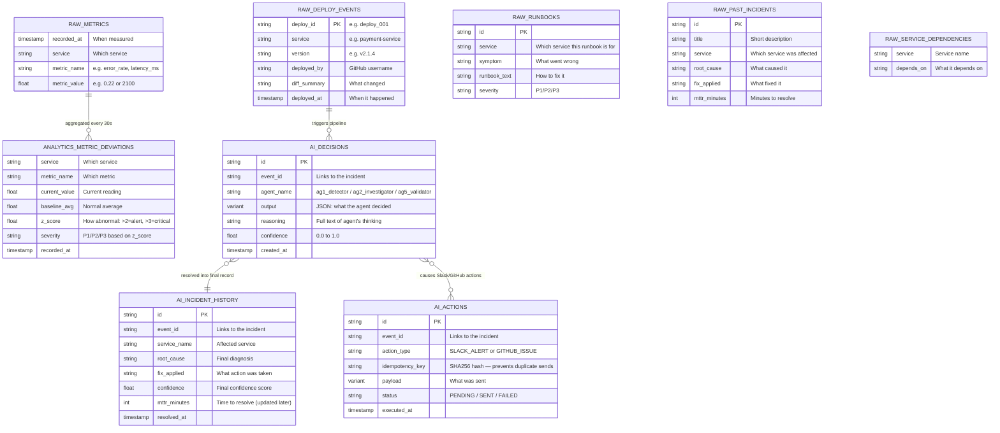
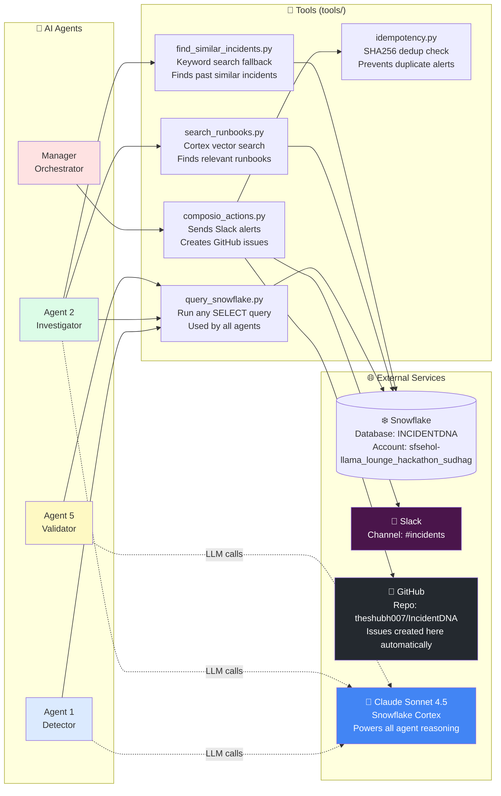
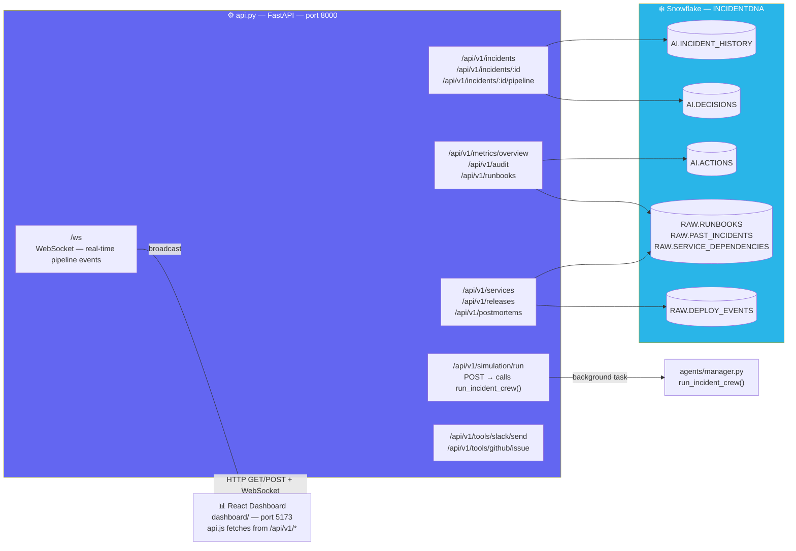
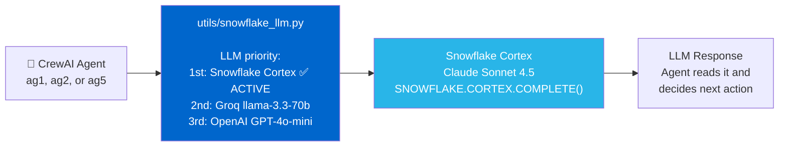
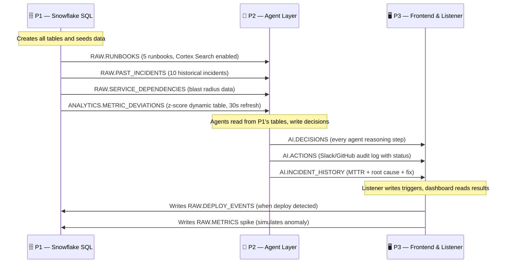

# IncidentDNA - Architecture

> **Auto-updated.** Run `python3 scripts/gen_architecture.py` manually,
> or it runs automatically on every `git pull` / `git commit` via hooks.
>
> **View diagrams:** Open this file in VSCode and press `Cmd+Shift+V` (Mac) or `Ctrl+Shift+V` (Windows/Linux).
> Requires extension: **Markdown Preview Mermaid Support** (`bierner.markdown-mermaid`) — install from VSCode Extensions sidebar.
> Or just open on **GitHub** — Mermaid renders natively there.

---

## 0. What Is This? (Beginner Friendly)

**IncidentDNA** is an AI system that watches your software services and automatically investigates problems — without a human having to do anything.

### The Problem It Solves
When something breaks in production (e.g. a database crashes, an API slows down), engineers normally have to:
1. Get paged at 3am
2. Manually look at logs and metrics
3. Figure out what went wrong
4. Create a ticket and alert the team on Slack

**IncidentDNA does all of that automatically, in under 2 minutes.**

### What Triggers It
A code deployment (git push) can introduce bugs. Our system listens for deployments via **Composio** (a tool that connects to GitHub and Slack), then injects a simulated metric spike into Snowflake to test the detection pipeline.

### What Happens Next (the full flow in plain English)
```
1. Developer pushes code to GitHub
2. Composio sees the push → writes a record in Snowflake
3. Snowflake detects a metric anomaly (e.g. error rate spiked)
4. 3 AI agents wake up and investigate:
      Agent 1 → "How bad is this? Which services are affected?"
      Agent 2 → "What caused this? Check runbooks + past incidents + live metrics"
      Agent 5 → "Do I trust Agent 2's answer? Challenge it."
5. If approved → post Slack alert + create GitHub issue automatically
6. Everything is stored in Snowflake for the dashboard
```

---

## 0b. Live Connections (What Is Connected Right Now)

| What | Value | Purpose |
|------|-------|---------|
| **LLM (AI Brain)** | Claude Sonnet 4.5 via Snowflake Cortex | Powers all 3 agents' reasoning |
| **Database** | Snowflake — `INCIDENTDNA` | Stores all metrics, incidents, decisions |
| **Snowflake Account** | `sfsehol-llama_lounge_hackathon_sudhag` | Hackathon account |
| **GitHub Repo (target)** | [`theshubh007/IncidentDNA`](https://github.com/theshubh007/IncidentDNA) | Where GitHub issues are auto-created |
| **Slack Channel** | `#incidents` | Where Slack alerts are posted |
| **Composio User ID** | `pg-test-a6c32032-f3c5-43d2-9090-e16ffbd46f0d` | Identity used to send Slack/GitHub actions |
| **Composio API** | `ak_Pv532zVAVQJoFTReaSgt` | Auth key for Composio |

> **To change the GitHub repo**: edit `GITHUB_REPO=` in `.env`
> **To change the Slack channel**: edit `SLACK_CHANNEL=` in `.env`

---

## 0c. How to Run It

```bash
# Step 1 — Check Snowflake connection and tables
python test_agent.py snowflake

# Step 2 — Run the full AI agent pipeline (triggers Slack + GitHub)
python test_agent.py agents

# Step 3 — Start the FastAPI backend (connects dashboard to live Snowflake data)
uvicorn api:app --reload --host 0.0.0.0 --port 8000

# Step 4 — Start the React dashboard (live data mode — needs Step 3 running)
cd dashboard && npm install && npm run dev
```

> All credentials are in `.env`. Ask a teammate for the file if you don't have it.
> The dashboard automatically uses live Snowflake data — `dashboard/.env` has `VITE_USE_LIVE_DATA=true`.

---

<!-- STATUS_START -->
## Status Dashboard

| Component | Key Files | Status |
|-----------|-----------|--------|
| Agent Layer | manager.py, ag1_detector.py, ag2_investigator.py, ... | ✅ Done |
| Tools | query_snowflake.py, search_runbooks.py, find_similar_incidents.py, ... | ✅ Done |
| Utils | snowflake_conn.py, snowflake_llm.py | ✅ Done |
| React Dashboard | App.jsx, api.js, mockData.js | ✅ Done (mock data) |
| Snowflake SQL | 01_schema.sql, 02_seed_data.sql, 03_dynamic_tables.sql | ✅ Done |
| Trigger Listener | trigger_listener.py | ✅ Done |
| Backend API | api.py | ✅ Done (for React live data) |

_Last updated: 2026-02-28 16:02 by scripts/gen_architecture.py_
<!-- STATUS_END -->

---

## 1. System Overview

> **How to read this diagram:** Follow the arrows top to bottom. Each box is a step. The blue box is the brain (AI pipeline). Orange box = actions taken automatically.



---

## 2. Agent Pipeline (Detail)

> **3 agents run sequentially.** Each agent uses AI (Claude Sonnet 4.5 via Snowflake Cortex) to reason about the incident. Each agent has specific tools it can call — like querying Snowflake or searching runbooks.



---

## 3. Snowflake Data Model

> **Snowflake** is the database. It has 3 schemas (folders): RAW (raw inputs), ANALYTICS (computed data), AI (agent outputs).



---

## 4. Tool to Agent Matrix

> **Tools** are functions that agents can call during their reasoning. Think of them as the agent's hands — it can look things up, query databases, or fire alerts.



---

## 5. FastAPI Backend — Dashboard ↔ Snowflake Bridge

> **`api.py`** is the glue between the React dashboard and Snowflake. It runs at `http://localhost:8000` and exposes every endpoint the dashboard needs.



**Key design decisions in `api.py`:**
- Every endpoint queries Snowflake first; falls back gracefully if a table is missing (returns `[]`)
- `/api/v1/simulation/run` runs the full agent pipeline in a FastAPI background task — returns immediately, broadcasts result via WebSocket when done
- `/api/v1/snowflake/query` is a SELECT-only proxy (rejects non-SELECT SQL)
- CORS is open to `localhost:5173` (Vite) and `localhost:3000`
- Idempotency is preserved — tool endpoints re-use the same `composio_actions.py` functions

---

## 6. LLM Architecture

> **How the AI brain works.** All 3 agents use Claude Sonnet 4.5 via Snowflake Cortex. The `snowflake_llm.py` file picks the LLM based on what is configured in `.env`.



**Current LLM config in `.env`:**
```
SNOWFLAKE_CORTEX_ENABLED=true   ← uses claude-sonnet-4-5 via Snowflake Cortex
GROQ_API_KEY=gsk_K13...         ← fallback if Cortex unavailable
```

---

## 7. Directory Structure

<!-- FILES_START -->
```
IncidentDNA/
├── agents/                     ✅
│   ├── manager.py                      ← ENTRY POINT: run_incident_crew()
│   ├── ag1_detector.py                 Classify severity + blast radius
│   ├── ag2_investigator.py             3-source root cause investigation
│   ├── ag5_validator.py                Adversarial judge (APPROVE|DEBATE)
│   ├── crew.py                         CrewAI Crew factory
│
├── tools/                      ✅
│   ├── query_snowflake.py              Generic SELECT (used by all agents)
│   ├── search_runbooks.py              Cortex Search on RAW.RUNBOOKS
│   ├── find_similar_incidents.py       CORTEX.SIMILARITY on RAW.PAST_INCIDENTS
│   ├── composio_actions.py             Slack + GitHub via Composio SDK
│   ├── idempotency.py                  SHA256 dedup before any external action
│
├── utils/                      ✅
│   ├── snowflake_conn.py               get_connection(), run_query(), run_dml()
│   ├── snowflake_llm.py                SnowflakeCortexLLM wrapper (BaseChatModel)
│
├── snowflake/                  ✅
│   ├── 01_schema.sql                 ✅  DDL: RAW.*, AI.*, ANALYTICS.*
│   ├── 02_seed_data.sql              ✅  Runbooks, past incidents, sample metrics
│   ├── 03_dynamic_tables.sql         ✅  ANALYTICS.METRIC_DEVIATIONS (z-score)
│
├── ingestion/                  ✅
│   └── trigger_listener.py         ✅  Composio WebSocket → run_incident_crew()
│
├── dashboard/                  ✅ (mock data)
│   └── src/
│       ├── pages/              8 pages: Overview, Incidents, Releases...
│       ├── api.js                      Toggle VITE_USE_LIVE_DATA for real data
│       ├── mockData.js                 Offline demo data
│
├── CLAUDE.md                          ✅  Claude Code auto-loads this every session
├── ARCHITECTURE.md                    ✅  This file — auto-updated by hooks
├── gen_architecture.py                ✅  Auto-updates this file
├── requirements.txt                   ✅
├── test_agent.py                      ✅  python test_agent.py [snowflake|agents]
├── .env                               ✅  Credentials
```
<!-- FILES_END -->

---

## 8. Integration Contracts (Who Talks to Who)

> This shows the data flow between the 3 team members' work areas.



---

## 9. Credentials Quick Reference

> Keep this handy when setting up on a new machine. All values also live in `.env`.

| Service | How to Get Access | Used For |
|---------|------------------|----------|
| **Snowflake** | Use shared credentials in `.env` | Database for everything |
| **Snowflake Cortex** | Included with Snowflake account | LLM for agents (claude-sonnet-4-5) |
| **Groq API** | [console.groq.com](https://console.groq.com) — free | Fallback LLM |
| **Composio** | [app.composio.dev](https://app.composio.dev) — shared API key in `.env` | Slack + GitHub integration |
| **GitHub** | Connect your GitHub account in Composio dashboard | Creates issues in `theshubh007/IncidentDNA` |
| **Slack** | Connect your Slack workspace in Composio dashboard | Posts to `#incidents` |
