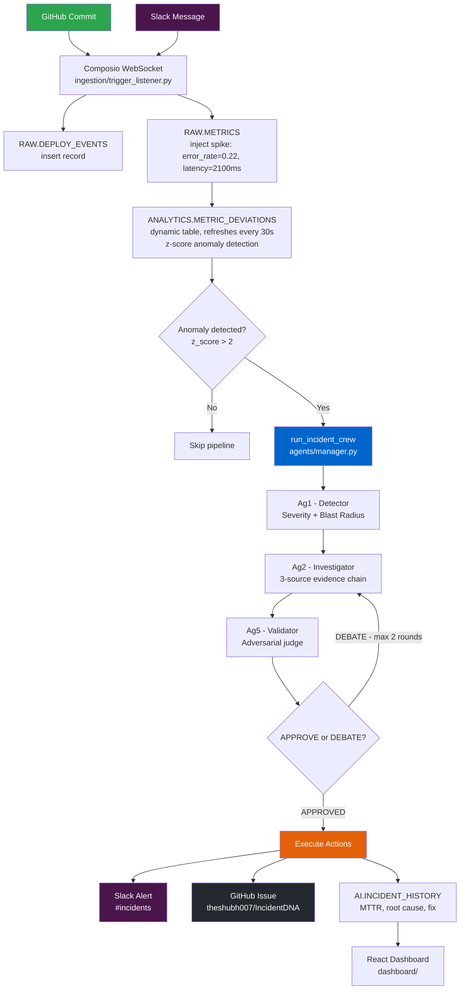
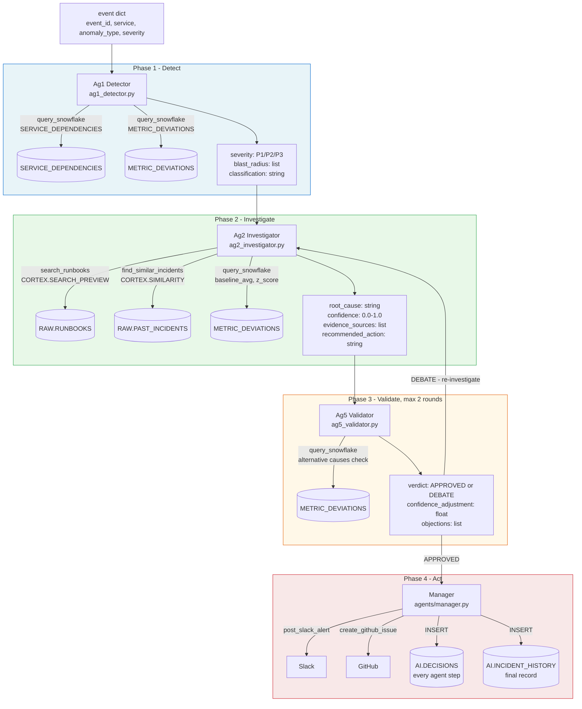
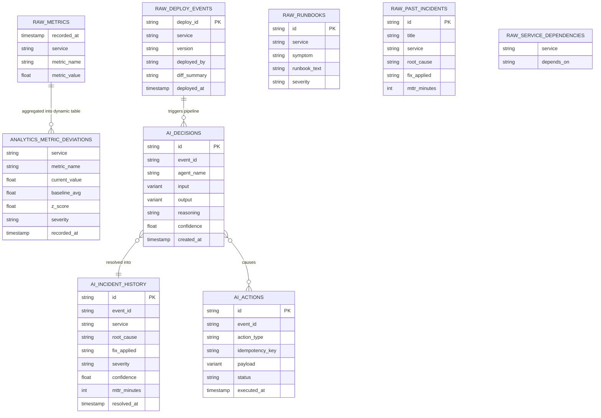
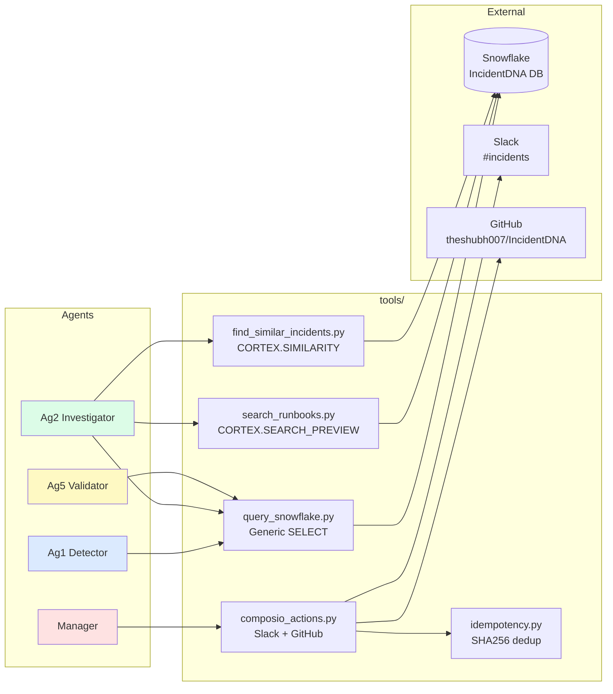
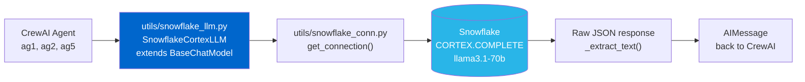
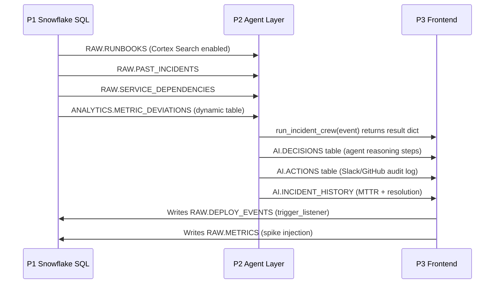

# IncidentDNA - Architecture

> **Auto-updated.** Run `python3 scripts/gen_architecture.py` manually,
> or it runs automatically on every `git pull` / `git commit` via hooks.
>
> **View diagrams:** Open this file in VSCode and press `Cmd+Shift+V` (Mac) or `Ctrl+Shift+V` (Windows/Linux).
> Requires extension: **Markdown Preview Mermaid Support** (`bierner.markdown-mermaid`) — install from VSCode Extensions sidebar.
> Or just open on **GitHub** — Mermaid renders natively there.

---

<!-- STATUS_START -->
## Status Dashboard

| Component | Key Files | Status |
|-----------|-----------|--------|
| Agent Layer | manager.py, ag1_detector.py, ag2_investigator.py, ... | ✅ Done |
| Tools | query_snowflake.py, search_runbooks.py, find_similar_incidents.py, ... | ✅ Done |
| Utils | snowflake_conn.py, snowflake_llm.py | ✅ Done |
| React Dashboard | App.jsx, api.js, mockData.js | ✅ Done (mock data) |
| Snowflake SQL | 01_schema.sql, 02_seed_data.sql, 03_dynamic_tables.sql | ✅ Done |
| Trigger Listener | trigger_listener.py | ✅ Done |
| Backend API | api.py | ❌ Missing |

_Last updated: 2026-02-27 23:11 by scripts/gen_architecture.py_
<!-- STATUS_END -->

---

## 1. System Overview



---

## 2. Agent Pipeline (Detail)



---

## 3. Snowflake Data Model



---

## 4. Tool to Agent Matrix



---

## 5. LLM Architecture



---

## 6. Directory Structure

<!-- FILES_START -->
```
IncidentDNA/
├── agents/                     ✅
│   ├── manager.py                      ← ENTRY POINT: run_incident_crew()
│   ├── ag1_detector.py                 Classify severity + blast radius
│   ├── ag2_investigator.py             3-source root cause investigation
│   ├── ag5_validator.py                Adversarial judge (APPROVE|DEBATE)
│   ├── crew.py                         CrewAI Crew factory
│
├── tools/                      ✅
│   ├── query_snowflake.py              Generic SELECT (used by all agents)
│   ├── search_runbooks.py              Cortex Search on RAW.RUNBOOKS
│   ├── find_similar_incidents.py       CORTEX.SIMILARITY on RAW.PAST_INCIDENTS
│   ├── composio_actions.py             Slack + GitHub via Composio SDK
│   ├── idempotency.py                  SHA256 dedup before any external action
│
├── utils/                      ✅
│   ├── snowflake_conn.py               get_connection(), run_query(), run_dml()
│   ├── snowflake_llm.py                SnowflakeCortexLLM wrapper (BaseChatModel)
│
├── snowflake/                  ✅
│   ├── 01_schema.sql                 ✅  DDL: RAW.*, AI.*, ANALYTICS.*
│   ├── 02_seed_data.sql              ✅  Runbooks, past incidents, sample metrics
│   ├── 03_dynamic_tables.sql         ✅  ANALYTICS.METRIC_DEVIATIONS (z-score)
│
├── ingestion/                  ✅
│   └── trigger_listener.py         ✅  Composio WebSocket → run_incident_crew()
│
├── dashboard/                  ✅ (mock data)
│   └── src/
│       ├── pages/              8 pages: Overview, Incidents, Releases...
│       ├── api.js                      Toggle VITE_USE_LIVE_DATA for real data
│       ├── mockData.js                 Offline demo data
│
├── CLAUDE.md                          ✅  Claude Code auto-loads this every session
├── ARCHITECTURE.md                    ✅  This file — auto-updated by hooks
├── gen_architecture.py                ✅  Auto-updates this file
├── requirements.txt                   ✅
├── test_agent.py                      ✅  python test_agent.py [snowflake|agents]
├── .env                               ✅  Credentials
```
<!-- FILES_END -->

---

## 7. Integration Contracts (P1 to P2 to P3)


